# PhysioCheck

App für Physiotherapiepraxen und ihre Patientinnen und Patienten: Heimübungspläne mit Videos, Termine, verordnete Sitzungen und selbst dokumentierte Durchführung (Adhärenz).

> **Stand 02.08.2026 (`main`):** Alles unten Beschriebene ist umgesetzt und geprüft (CI grün). Ausführlicher Funktionsstatus: `docs/FEATURE_STATUS.md` · Änderungsverlauf: `docs/CHANGELOG.md`.

## Screenshots

Alle Bilder sind echte Aufnahmen aus der laufenden Demo-Umgebung (`docs/screenshots/`), keine Mockups.

### Praxisoberfläche (Web)

<table>
<tr>
<td width="50%">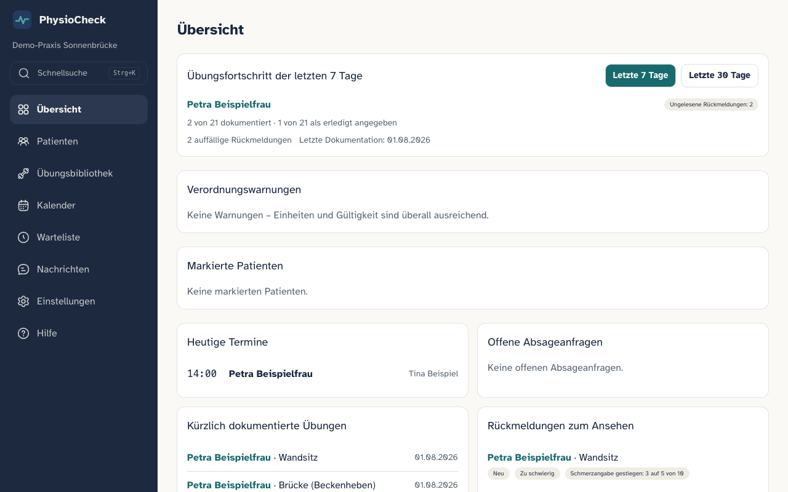<br>Übersicht mit Übungsfortschritt, heutigen Terminen und Rückmeldungen</td>
<td width="50%">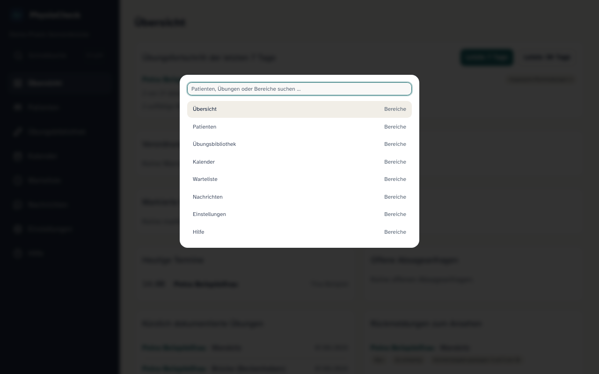<br>Schnellsuche (Strg/Cmd+K) für Patienten, Übungen und Bereiche</td>
</tr>
<tr>
<td width="50%">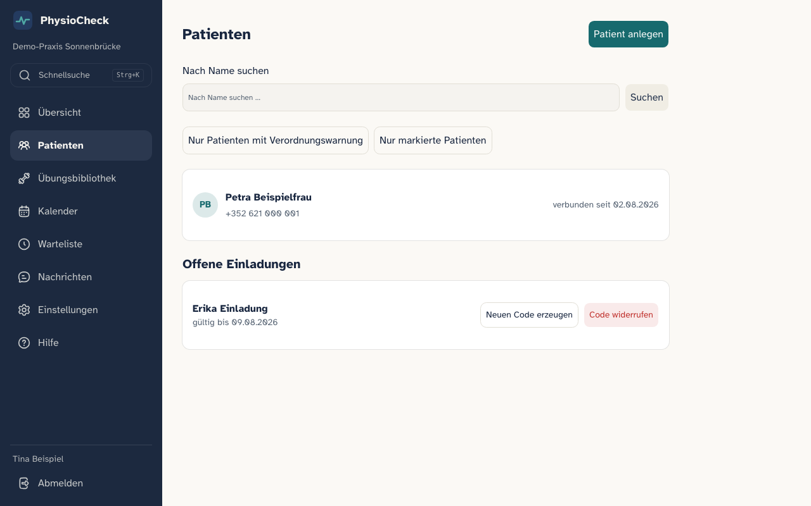<br>Patientenliste mit Einladungsverwaltung</td>
<td width="50%">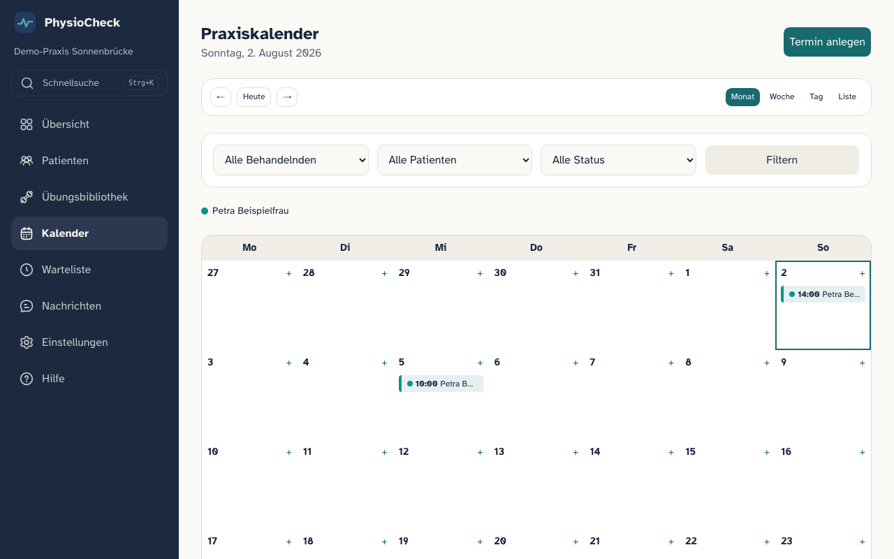<br>Kalender mit farblich markierten Patienten</td>
</tr>
<tr>
<td width="50%">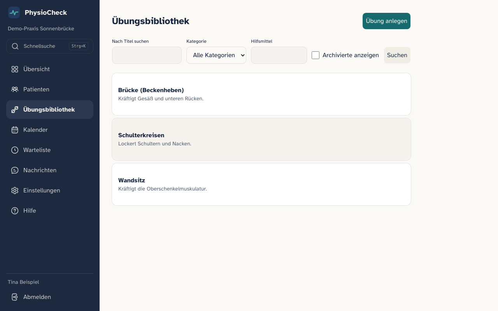<br>Übungsbibliothek der Praxis</td>
<td width="50%">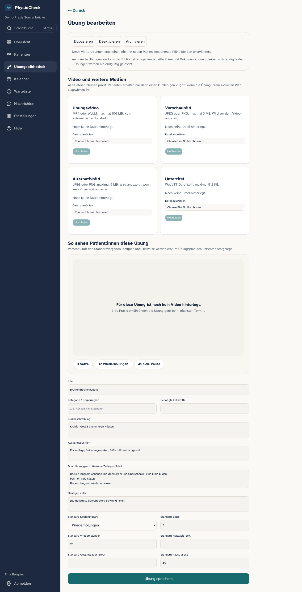<br>Übung anlegen: Video-/Bild-Upload direkt im selben Schritt, inklusive Vorschau, wie Patient:innen die Übung sehen werden</td>
</tr>
<tr>
<td width="50%">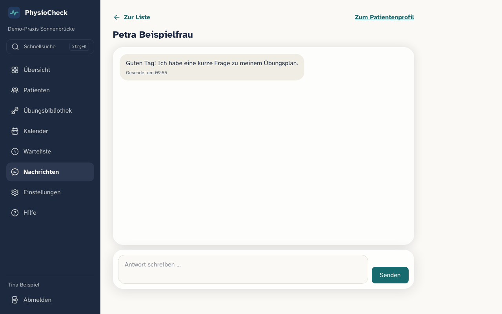<br>Nachrichten zwischen Praxis und Patient:in</td>
<td width="50%">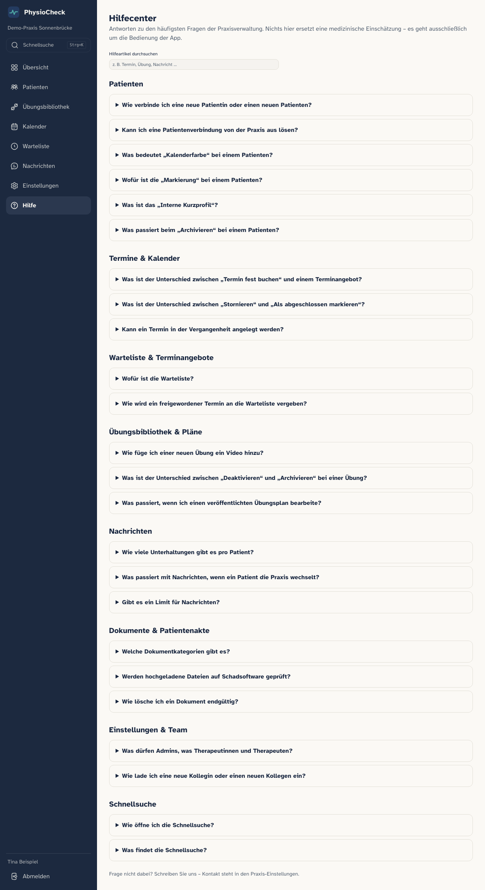<br>Durchsuchbares Hilfecenter für Praxismitarbeitende</td>
</tr>
</table>

### Patientenoberfläche (mobile-first, Web und native App optisch identisch)

<table>
<tr>
<td width="25%">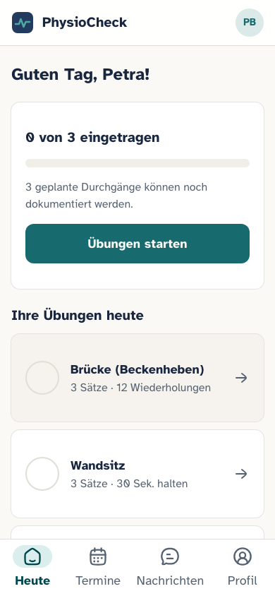<br>Heute: geplante Übungen mit Fortschritt</td>
<td width="25%">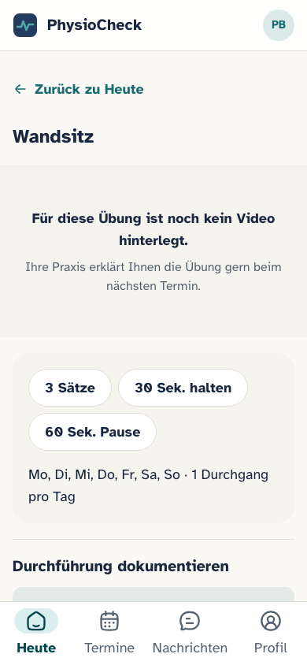<br>Video-first-Übungsansicht mit Vorgaben</td>
<td width="25%">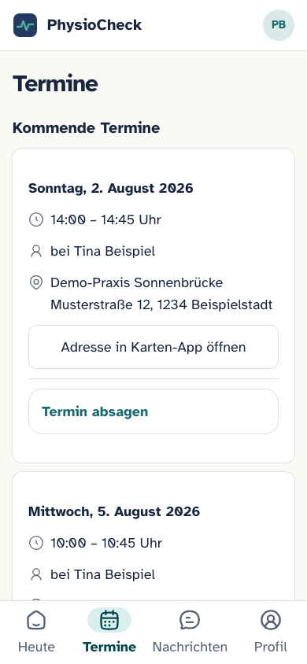<br>Kommende Termine mit Adresse</td>
<td width="25%">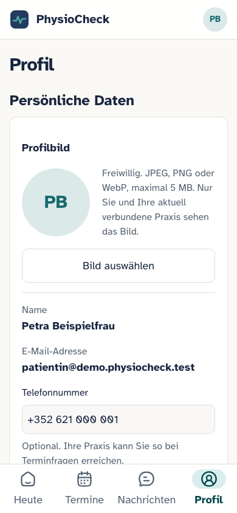<br>Profil mit Profilbild, Kontaktdaten und Sicherheit</td>
</tr>
</table>

## Voraussetzungen (einmalig)

1. **Node.js 22** (empfohlen über [nvm](https://github.com/nvm-sh/nvm)): `nvm install 22`
2. **pnpm**: `npm install -g corepack@latest && corepack enable pnpm`
3. **Docker Desktop** (für die lokale Datenbank): [docker.com](https://www.docker.com/products/docker-desktop/) – muss laufen.
4. **Supabase CLI**: `brew install supabase/tap/supabase`

## Schnellstart (ein Befehl)

```bash
git clone https://github.com/TomGroeber/physio-check.git
cd physio-check
pnpm quickstart
```

Das erledigt automatisch: Abhängigkeiten installieren, lokale Datenbank/Auth/Storage starten, `.env.local` selbst befüllen, Demodaten anlegen, Server starten. Am Ende läuft die App unter http://localhost:3000. Nur für den lokalen Test – kein produktives Deployment, keine echten Daten.

**Alternative mit einzelnen Schritten** (zum Verstehen/Anpassen):

```bash
pnpm install && supabase start && cp .env.example .env.local
pnpm db:reset && pnpm seed && pnpm dev
```

`.env.local`-Werte kommen aus `supabase status` (API URL, anon key, service_role key).

## Demo-Zugänge (nur lokal, frei erfunden)

| Rolle | E-Mail | Passwort |
|---|---|---|
| Patientin | `patientin@demo.physiocheck.test` | `PhysioDemo2026!` |
| Therapeutin | `therapeutin@demo.physiocheck.test` | `PhysioDemo2026!` |
| Praxis-Admin | `admin@demo.physiocheck.test` | `PhysioDemo2026!` |
| Plattform-Admin (Betreiber) | `betreiber@demo.physiocheck.test` | `PhysioDemo2026!` |

Demo-Einladungscode: `DEMA-PHYS-2326` · Demo-Daten zurücksetzen: `pnpm db:reset && pnpm seed` · Mails lokal ansehen: http://localhost:54324 (Mailpit)

## Als Betreiber: Neue Praxis anlegen und Zugang verschicken

1. Als `betreiber@demo.physiocheck.test` anmelden → `/admin/practices/new`.
2. Praxisdaten + Name/E-Mail der ersten Admin-Person eintragen → **„Praxis anlegen"**.
3. Den angezeigten Einladungslink kopieren und **selbst** an die Praxis schicken (kein automatischer Mailversand).
4. Die Praxis öffnet den Link, legt ihr eigenes Passwort fest – fertig, sie ist drin.
5. Die Praxis lädt danach ihre eigenen Mitarbeitenden selbst ein (`/practice/settings`), genauso per Link.

Vollständige Anleitung mit allen Details und Screens: **`docs/PLATFORM_ADMIN_GUIDE.md`**.

**Praxismitglied hat Passwort und E-Mail vergessen?** Im Betreiberportal bei der Person auf „Zugang zurücksetzen" klicken, neue E-Mail-Adresse eintragen, Link verschicken – die Mitgliedschaft (Rolle, Praxis, alle Daten) bleibt dabei erhalten. Details ebenfalls in `docs/PLATFORM_ADMIN_GUIDE.md`.

## Häufigste Befehle

```bash
pnpm dev          # Entwicklungsserver
pnpm typecheck    # TypeScript prüfen
pnpm lint         # Codequalität prüfen
pnpm test         # Unit-/Komponententests (Vitest)
pnpm test:rls     # Datenbank-Sicherheitsproben (Supabase muss laufen)
pnpm e2e          # End-to-End-Tests (Playwright; Supabase + Seed nötig)
pnpm build        # Production Build
pnpm db:reset     # Datenbank neu aufbauen (Migrationen)
pnpm seed         # Demo-Daten neu anlegen
```

Klick-Anleitungen für einzelne Funktionen (Übungsdokumentation, Kalender, Patientenakte …): **`docs/MANUAL_TESTING_GUIDE.md`**.

## Wichtige Dokumente

- `docs/PLATFORM_ADMIN_GUIDE.md` – Betreiberportal für Tom: Praxis anlegen, Zugang zurücksetzen, was global/praxisweit konfigurierbar ist
- `docs/FEATURE_STATUS.md` – jede Funktion mit Prüfstatus
- `docs/CHANGELOG.md` – Änderungsverlauf
- `docs/MANUAL_TESTING_GUIDE.md` – Klick-Anleitungen für einzelne Funktionen
- `docs/PRODUCT_SPEC.md` – Produktumfang und Akzeptanzkriterien
- `docs/ARCHITECTURE.md` – Architektur und Sicherheitsentscheidungen
- `docs/DATA_MODEL.md` – Datenmodell (ER-Diagramm)
- `docs/PRIVACY_SECURITY.md` – Datenschutz und Sicherheit
- `docs/TEST_MATRIX.md` – Anforderung-zu-Test-Zuordnung
- `docs/AI_HANDOFF.md` – aktueller Übergabestand für Claude/ChatGPT
- `CLAUDE.md` – verbindliche Projektregeln
- `TASKS.md` / `DECISIONS.md` – Aufgaben und Entscheidungen

## Sicherheit (Kurzfassung)

- Rollen und Rechte liegen ausschließlich in der Datenbank (Row Level Security auf jeder patientenbezogenen Tabelle).
- Der Service-Role-Schlüssel existiert nur serverseitig (`.env.local`, nie im Browser, nie im Repository).
- Interne Patientendokumente sind für Patienten unsichtbar und nur über kurzlebige signierte URLs für aktive Praxismitglieder erreichbar.
- Keine echten Personen- oder Gesundheitsdaten in Entwicklung und Tests.
