# PhysioCheck – Datenmodell

## Ergänzung Phase D/E: typisierte Planversionen

- `exercise_plan_items.schedule` akzeptiert Legacy-Werte und für neue Versionen zwei typisierte Formen: feste ISO-Wochentage mit `times_per_day`/`preferred_times` oder ein flexibles `times_per_week`-Ziel.
- Ein partieller Unique-Index erlaubt je Praxis und Patient höchstens einen aktiven Plan.
- Planänderungen laufen ausschließlich über `publish_exercise_plan`: eine Transaktion erzeugt die unveränderliche Version samt vollständigem Item-Satz und setzt erst danach `current_version_id`. Direkte Client-Schreib-Policies auf Plan/Version/Item wurden entfernt.
- Planarchivierung beendet nur die aktive Zuweisung. Alte Versionen, Items und referenzierende Selbstauskünfte bleiben erhalten.

## Ergänzung Phase F: Durchgänge

- `completion_logs.occurrence_index` ist pro Patient, Plan-Item und Praxiskalendertag eindeutig. Alte Zeilen werden nach `performed_at, id` durchnummeriert und bleiben unverändert erhalten.
- Feste Tagespläne verwenden Indizes 1 bis `times_per_day`. Flexible Wochenpläne erlauben höchstens Index 1 pro Tag, bis das Wochenziel erreicht ist.
- Nur die atomare Funktion `record_exercise_occurrence` darf neue Logs anlegen. Sie erstellt den `prescription_snapshot` aus dem aktuellen Item und speichert darin auch geplante Anzahl und vergebenen Index.

## Ergänzung Phase H: Rückmeldungs-Lesestatus

- `completion_logs.reviewed_at` und `reviewed_by` sind reine Praxis-Workflow-Metadaten. Sie ändern keine Selbstauskunft und dürfen nur über `mark_completion_log_reviewed` gesetzt werden.
- Ein partieller Index beschleunigt ungelesene Rückmeldungen. Die RPC prüft die aktive Mitgliedschaft in der Praxis des zugehörigen Plans und schreibt ein inhaltsfreies Audit-Ereignis.

## Phase-C-Ergänzungen

- Keine neuen Tabellen. Die freie Registrierung ist reine Anwendungslogik (D-018).
- `completion_logs`: Lese-Policy ersetzt – Praxismitglieder lesen nur Protokolle, deren Plan-Item zu einem Plan der eigenen Praxis gehört (Migration `20260711170000`, D-019). Patienten lesen weiterhin nur eigene Protokolle; Einträge bleiben unveränderlich (keine Update-/Delete-Policy).
- `prescription_snapshot` enthält: `exercise_id`, `exercise_title`, `sets`, `repetitions`, `hold_seconds`, `total_duration_seconds`, `rest_seconds`, `schedule`, `note` (Vorgaben – keine Gesundheitsdaten).
- Duplikatschutz „gleiches Item am gleichen Tag" bleibt bewusst applikationsseitig (D-020).

## Phase-B-Ergänzungen

- `invite_redemption_attempts`: serverseitige Rate-Limit-Ereignisse; keine IP-Adresse und kein User-Agent im Klartext.
- `patient_practice_links`: partieller Unique-Index stellt im MVP genau eine aktive Praxis pro Patient sicher; beendete Links bleiben erhalten.
- `redeem_patient_invite(...)`: atomare Einlösung und Praxiswechsel.
- `renew_patient_invite(...)`: atomare Code-Erneuerung; der vorherige Code wird im selben Vorgang widerrufen.

> Stand: 2026-07-11 · Status: Entwurf Phase 0, wird mit den Migrationen in Phase 1 final. Konventionen: UUID-Primärschlüssel, `timestamptz` (UTC), `created_at`/`updated_at`, Soft-Delete nur wo fachlich nötig (Übungen: `is_active` statt Löschen; Protokolle werden nie gelöscht).

## 1. ER-Übersicht

```mermaid
erDiagram
    profiles ||--o{ practice_members : "ist Mitarbeiter in"
    profiles ||--o{ patient_practice_links : "ist Patient bei"
    practices ||--o{ practice_members : "hat"
    practices ||--o{ patient_practice_links : "betreut"
    practices ||--o{ patient_invites : "lädt ein"
    practices ||--o{ exercises : "besitzt Bibliothek"
    exercises ||--o{ exercise_media : "hat Medien"
    practices ||--o{ exercise_plans : ""
    profiles ||--o{ exercise_plans : "Patient hat"
    exercise_plans ||--o{ exercise_plan_versions : "versioniert als"
    exercise_plan_versions ||--o{ exercise_plan_items : "enthält"
    exercises ||--o{ exercise_plan_items : "wird verwendet in"
    exercise_plan_items ||--o{ completion_logs : "dokumentiert durch"
    profiles ||--o{ completion_logs : "Patient dokumentiert"
    practices ||--o{ appointments : ""
    profiles ||--o{ appointments : "Patient hat"
    practice_members ||--o{ appointments : "behandelnde Person"
    appointments ||--o{ cancellation_requests : "hat Anfrage"
    profiles ||--o{ notifications : "empfängt"
    profiles ||--o{ consent_records : "willigt ein"
    profiles ||--o{ audit_events : "handelt als Akteur"

    profiles {
        uuid id PK "= auth.users.id"
        text full_name
        text locale "default 'de'"
        timestamptz created_at
    }
    practices {
        uuid id PK
        text name
        text address_street
        text address_city
        text phone
        text timezone "IANA, z.B. Europe/Luxembourg"
        jsonb settings "z.B. inactivity_days, auto_confirm_cancellations (spaeter)"
    }
    practice_members {
        uuid id PK
        uuid practice_id FK
        uuid profile_id FK
        text role "therapist | admin"
        boolean is_active
    }
    patient_practice_links {
        uuid id PK
        uuid patient_profile_id FK
        uuid practice_id FK
        uuid primary_therapist_id FK "practice_members, optional"
        text status "active | ended"
        timestamptz linked_at
    }
    patient_invites {
        uuid id PK
        uuid practice_id FK
        uuid created_by FK "practice_members"
        text patient_display_name "Datenminimierung: nur Anzeigename"
        text code_hash "nie der Klartext-Code"
        timestamptz expires_at "default +7 Tage"
        timestamptz revoked_at
        timestamptz used_at
        uuid used_by_profile_id FK
    }
    exercises {
        uuid id PK
        uuid practice_id FK
        text title
        text description
        text starting_position
        jsonb steps "geordnete Durchfuehrungsschritte"
        text common_mistakes
        text equipment
        text default_dosage_type "reps | duration"
        int default_sets
        int default_repetitions
        int default_hold_seconds
        int default_rest_seconds
        boolean is_active
    }
    exercise_media {
        uuid id PK
        uuid exercise_id FK
        text kind "video | thumbnail | captions | fallback_image"
        text storage_path "privater Bucket"
        text mime_type
        bigint size_bytes
    }

    %% Unique: (exercise_id, kind) – pro Übung höchstens ein Medium je Art.
    exercise_plans {
        uuid id PK
        uuid practice_id FK
        uuid patient_profile_id FK
        uuid created_by FK
        text title
        text status "active | archived"
        uuid current_version_id FK
    }
    exercise_plan_versions {
        uuid id PK
        uuid plan_id FK
        int version_number
        uuid created_by FK
        text change_note
        timestamptz created_at
    }
    exercise_plan_items {
        uuid id PK
        uuid plan_version_id FK
        uuid exercise_id FK
        int sort_order
        date start_date
        date end_date "optional"
        jsonb schedule "weekdays[] ODER times_per_week"
        int sets
        int repetitions
        int hold_seconds
        int total_duration_seconds
        int rest_seconds
        text note
    }
    completion_logs {
        uuid id PK
        uuid patient_profile_id FK
        uuid plan_item_id FK
        date performed_on "Kalendertag in Patienten-Zeitzone"
        timestamptz performed_at
        text status "completed | partial | too_difficult | not_possible"
        int sets_completed
        int pain_before "0-10, optional"
        int pain_after "0-10, optional"
        text note
        jsonb prescription_snapshot "Vorgaben zum Zeitpunkt der Durchfuehrung"
    }
    appointments {
        uuid id PK
        uuid practice_id FK
        uuid patient_profile_id FK
        uuid therapist_member_id FK
        timestamptz starts_at
        timestamptz ends_at
        text timezone
        text location_name
        text address
        text note "neutral, optional"
        text status "scheduled | cancellation_requested | cancelled | completed"
    }
    cancellation_requests {
        uuid id PK
        uuid appointment_id FK
        uuid requested_by FK "profiles"
        text reason "optional"
        text status "pending | approved | rejected"
        uuid decided_by FK "practice_members, optional"
        timestamptz decided_at
    }
    notifications {
        uuid id PK
        uuid recipient_profile_id FK
        text type "appointment_reminder | plan_changed | cancellation_decided | ..."
        text title
        text body "keine sensiblen Details"
        jsonb reference "entity_type + entity_id"
        timestamptz read_at
    }
    consent_records {
        uuid id PK
        uuid profile_id FK
        text document_type "privacy_policy | terms"
        text document_version
        timestamptz consented_at
    }
    audit_events {
        uuid id PK
        uuid actor_profile_id FK
        uuid practice_id FK "optional"
        text event_type "invite_created | invite_revoked | plan_version_created | ..."
        text entity_type
        uuid entity_id
        jsonb metadata "keine Gesundheitsdetails"
        timestamptz created_at
    }
```

## 2. Begründung der wichtigsten Beziehungen

**`profiles` trägt keine Rolle.** Jeder `auth.users`-Eintrag bekommt genau ein Profil. Privilegien entstehen ausschließlich durch Zeilen in `practice_members` (Therapeut/Admin **pro Praxis**) – geschrieben nur durch serverseitige Admin-Prozesse. Damit ist Selbst-Eskalation über das Frontend strukturell unmöglich, und ein Therapeut kann später in mehreren Praxen arbeiten.

**`patient_practice_links` statt Praxis-Feld am Profil.** Die Patient-Praxis-Beziehung ist eine eigene Entität mit Status und Historie. Ein Patient kann (später) mehrere oder wechselnde Praxen haben; RLS-Policies der Praxis-Seite hängen an dieser Tabelle: Ein Therapeut sieht Patientendaten nur, wenn ein aktiver Link zu seiner Praxis existiert.

**`patient_invites` speichert nur `code_hash`.** Der Klartext-Code existiert nur im Moment der Erzeugung (Anzeige für den Therapeuten). Einlösung: Hash-Vergleich + Prüfung `expires_at`/`revoked_at`/`used_at` in einer Transaktion. „Neuen Code erzeugen" setzt `revoked_at` des alten aktiven Codes.

**Planversionierung (`exercise_plans` → `versions` → `items`).** Jede Änderung erzeugt eine neue Version mit vollständigem Item-Satz; `current_version_id` zeigt auf die gültige. `completion_logs` referenziert das konkrete `plan_item` (das zu genau einer Version gehört) **und** hält zusätzlich `prescription_snapshot` – doppelte Absicherung, dass spätere Planänderungen alte Protokolle nie verfälschen.

**`completion_logs.performed_on`** (Kalendertag) ermöglicht die Duplikat-Bremse „gleiches Item am gleichen Tag" als sanfte Warnung (kein harter Unique-Constraint, um Nutzer nicht zu blockieren – z. B. bei 2× täglich verordneten Übungen wird die Vorgabe geprüft).

**`appointments.status`** deckt den Absage-Workflow ab; die eigentliche Anfrage lebt in `cancellation_requests` (wer, wann, warum, wer hat entschieden). So bleibt die Historie erhalten, auch wenn eine Anfrage abgelehnt wird und der Termin `scheduled` bleibt.

**`audit_events`** ist bewusst schlank: Akteur, Ereignistyp, Entität, minimale Metadaten. Keine Schmerzwerte, keine Notizen, keine Gesundheitsdetails.

## 3. RLS-Grundprinzipien (Umsetzung in Phase 1)

| Tabelle | Patient | Praxis-Mitglied |
|---|---|---|
| eigene Daten (`profiles`, `notifications`, `consent_records`) | nur eigene Zeile(n) | nur eigene Zeile(n) |
| `completion_logs`, `exercise_plans*`, `appointments` | nur wo `patient_profile_id = auth.uid()` | nur wo aktives `practice_members`-Mitglied der zugehörigen Praxis |
| `exercises`, `exercise_media`, `patient_invites` | Patient: nur Übungen aus eigenen Plan-Items (Lesen) | Mitglieder der Praxis |
| `practice_members` | kein Zugriff | lesen eigene Praxis; schreiben nur Admin/Server |
| `audit_events` | kein Zugriff | lesen Admin der Praxis; schreiben nur Server |

Alle Schreibwege laufen zusätzlich durch die Service-Schicht mit Zod-Validierung; RLS ist die zweite Verteidigungslinie.

## 4. Indizes (geplant)

Fremdschlüssel-Indizes überall; zusätzlich: `patient_invites(code_hash)` unique, `completion_logs(patient_profile_id, performed_on)`, `appointments(practice_id, starts_at)`, `appointments(patient_profile_id, starts_at)`, `notifications(recipient_profile_id, read_at)`.
