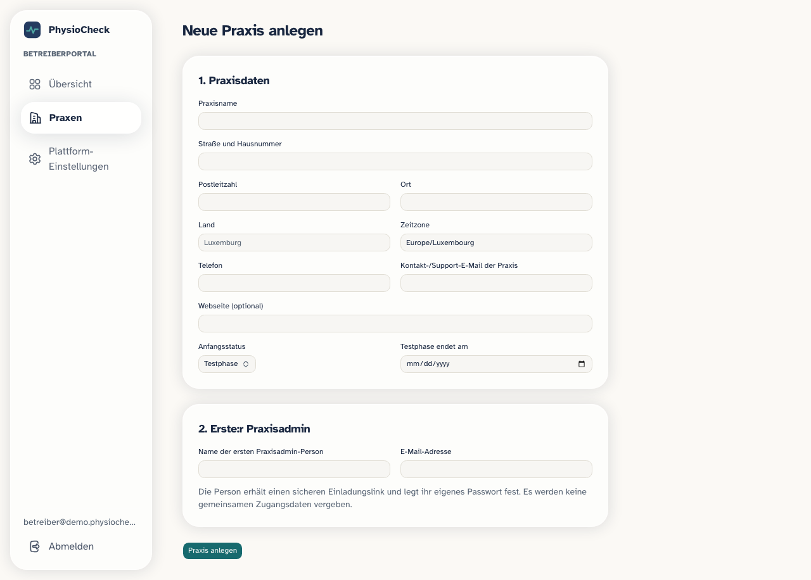

# PhysioCheck – Betreiberportal (für Tom, nicht-technisch)

Dieses Dokument erklärt das neue Betreiber-Admin-Interface unter `/admin`: wofür es gedacht ist, was dort einstellbar ist – und was **niemals** über eine Oberfläche einstellbar sein darf.

## Wofür ist das Portal?

Als Betreiber von PhysioCheck kannst du dort:

- neue Physiotherapiepraxen anlegen (Testkunden oder echte Kunden) und deren ersten Praxisadmin per Link einladen,
- Praxen aktivieren, in eine Testphase setzen, sperren oder archivieren (nichts wird dabei gelöscht),
- weitere Mitarbeitende für eine Praxis einladen (falls die Praxis das nicht selbst erledigen kann),
- globale Produkteinstellungen ändern (Name/Support-Kontakt/Wartungsbanner/Funktionsschalter),
- eine schlanke Übersicht je Praxis sehen (wie viele Mitarbeitende, wie viele Patient:innen, allgemeine Zahlen) – **keine** medizinischen Daten einzelner Patient:innen.

## Wer darf das Portal benutzen?

Nur Konten, die als „Plattform-Admin" freigeschaltet sind. Das ist etwas völlig anderes als eine Praxisrolle (Therapeut:in/Admin einer Praxis) – die beiden Dinge sind technisch komplett getrennt. Niemand kann sich selbst zum Plattform-Admin machen, auch nicht über Umwege in der App. Freischalten/Entziehen geht ausschließlich über ein Kommandozeilen-Skript, das du (oder jemand mit direktem Serverzugriff) selbst ausführst:

```bash
pnpm platform-admin grant --email tom@example.com --yes
pnpm platform-admin revoke --email jemand@example.com --yes
pnpm platform-admin list
```

Das Skript verlangt absichtlich das `--yes`-Flag, damit niemand aus Versehen jemanden zum Betreiber macht.

## Was ist global einstellbar (gilt für alle Praxen)?

Über „Plattform-Konfiguration" im Portal:

- Produktname/Branding-Texte, Support-E-Mail/-Link
- Datenschutz-/Impressum-Link
- Wartungsbanner (Text + An/Aus)
- Standard-Zeitzone/-Sprache für neu angelegte Praxen
- Funktionsschalter (Feature Flags) für Praxen

## Was ist je Praxis einstellbar?

Über „Praxis-Details" im Portal bzw. für die Praxis selbst über „Einstellungen":

- Stammdaten (Name, Adresse, Telefon, Zeitzone, Support-Kontakt)
- Status (Testphase/aktiv/gesperrt/archiviert) inklusive interner, nicht-medizinischer Notiz – nur im Portal, nicht durch die Praxis selbst
- Betriebliche Einstellungen: Standard-Termindauer, Stornofrist + -text, Warnschwelle für wenige Behandlungseinheiten, Akzentfarbe, patientenseitiger Sicherheitshinweistext
- Mitarbeitende: einladen, Rolle setzen, aktiv/inaktiv setzen

## Was ist NIEMALS über eine Oberfläche einstellbar?

Das ist die wichtigste Grenze in diesem Dokument – sie schützt vor Sicherheitslücken:

- Supabase-/Service-Role-Schlüssel, SMTP-Passwörter, Push-Zertifikate (APNs/FCM) – diese liegen ausschließlich in Umgebungsvariablen auf dem Server, nie in einer Datenbanktabelle, die eine Oberfläche beschreiben könnte.
- Row-Level-Security-Richtlinien und das Datenbankschema selbst – Änderungen daran sind Code-Änderungen (Migrationen), keine Konfiguration.
- Storage-Zugriffsrichtlinien (wer welche Dateien sehen darf).
- Native App-Kennungen (Bundle-ID/Package-Name) und Signierungszertifikate.
- Rechtsverbindliche Texte (Datenschutzerklärung, Impressum, AGB) – diese benötigen eine juristische Prüfung durch eine zuständige Person, bevor sie als „final" gelten; das Portal kann solche Texte höchstens als erkennbaren Entwurf verwalten, nie als verbindlich veröffentlicht ausgeben.

Kurz gesagt: Alles, was bei falscher Bedienung eine Sicherheitslücke, einen Datenschutzverstoß oder eine rechtliche Fehlaussage erzeugen könnte, bleibt bewusst Code statt Oberfläche.

## Was das Portal ausdrücklich NICHT kann

- Medizinische Patientendaten lesen (Übungspläne, Termine, Selbstauskünfte, Dokumente, Verordnungen) – das Portal zeigt nur datensparsame Verwaltungszahlen.
- Sich als eine andere Person anmelden („Impersonation") – das gibt es bewusst nicht. Sollte später ein Support-Zugriff nötig werden, muss das ein eigenes, offen dokumentiertes „Break-Glass"-Konzept werden, nie eine stillschweigende Funktion.
- Praxen oder deren Historie endgültig löschen – Sperren/Archivieren verstecken nur, sie löschen nicht.

## Schritt für Schritt: Eine neue Praxis als Kundin anlegen

Beispiel-Szenario: Du verkaufst PhysioCheck an eine Physiopraxis und richtest ihren Zugang ein.

### Voraussetzung: Du selbst brauchst Zugang zum Betreiberportal

Falls dein Konto noch nicht als Plattform-Admin freigeschaltet ist (einmalig, per Kommandozeile):

```bash
pnpm platform-admin grant --email deine@email.tld --yes
```

### Schritt 1 – Praxis anlegen



1. Im Portal auf **„Praxen"** klicken, dann **„Neue Praxis anlegen"** (`/admin/practices/new`).
2. Abschnitt **„1. Praxisdaten"** ausfüllen: Praxisname (Pflichtfeld), Adresse, Zeitzone (Pflichtfeld, ist vorausgefüllt), Telefon, Kontakt-E-Mail der Praxis, Anfangsstatus (**„Testphase"** oder **„Sofort aktiv"**; bei Testphase zusätzlich das Enddatum).
3. Abschnitt **„2. Erste:r Praxisadmin"** ausfüllen: Name und E-Mail-Adresse der Person, die als Erste:r Zugang zur Praxis bekommen soll.
4. Auf **„Praxis anlegen"** klicken.

> **Hinweis (bekannte Einschränkung):** Die Felder „Land" und „Webseite" im Formular werden aktuell zwar angezeigt, aber nicht gespeichert – das ist noch nicht angebunden. Sag Bescheid, falls du diese Felder brauchst, dann ergänze ich das.

### Schritt 2 – Einladungslink an die Praxis weitergeben

Nach dem Anlegen erscheint direkt auf derselben Seite ein Einladungslink (**„Einladungslink (einmalig, 7 Tage gültig)"**) mit einem **„Link kopieren"**-Button.

- **Es wird keine E-Mail automatisch verschickt.** Du musst den Link selbst kopieren und der Praxis schicken (E-Mail, WhatsApp, wie auch immer).
- Der Link ist einmalig nutzbar und läuft nach 7 Tagen ab.
- Über **„Zur Praxis"** kommst du direkt zur neu angelegten Praxis im Portal.

### Schritt 3 – Die Praxis nimmt die Einladung an

Das macht die Praxis selbst, du musst nichts weiter tun:

1. Die Person öffnet den Link, landet auf einer Bestätigungsseite mit Praxisname und Rolle.
2. Hat sie noch kein Konto: **„Neues Konto mit dieser E-Mail-Adresse erstellen"** → Name eingeben, Passwort selbst festlegen (die E-Mail-Adresse ist durch die Einladung bereits vorgegeben und lässt sich nicht ändern) → Bestätigungsmail von Supabase öffnen und Link anklicken.
3. Danach (oder direkt, falls schon ein Konto bestand): **„Einladung annehmen"** klicken.
4. Die Person landet in ihrem eigenen Praxisbereich (`/practice`) – fertig.

Falls der Link abgelaufen/schon benutzt ist, bekommt die Person eine klare Fehlermeldung mit Bitte um eine neue Einladung (du müsstest dann ggf. im Portal eine erneute Einladung für diese Praxis auslösen).

### Schritt 4 – Die Praxis lädt ihre eigenen Mitarbeitenden ein

Das erledigt die Praxis komplett selbst, ohne dich:

1. Praxisadmin geht zu **„Einstellungen"** (`/practice/settings`) → Abschnitt **„Mitarbeitende Ihrer Praxis"**.
2. Formular **„Mitarbeiter:in einladen"**: Name, E-Mail-Adresse, Rolle (**„Admin"** oder **„Therapeut:in"**) → **„Einladung senden"**.
3. Auch hier: Der Link wird nur angezeigt (**„Teilen Sie diesen Link mit der Person"**), keine automatische E-Mail – die Praxis muss ihn selbst weitergeben.
4. Die eingeladene Person durchläuft denselben Ablauf wie in Schritt 3.

Offene Einladungen lassen sich dort auch widerrufen oder erneuern; bestehende Mitarbeitende lassen sich deaktivieren/reaktivieren. Die letzte aktive Admin-Person einer Praxis kann nicht deaktiviert werden (technisch verhindert), damit keine Praxis ohne Admin dasteht.

### Schritt 5 – Bei Bedarf: Status ändern (Testphase → Aktiv, Sperren, Archivieren)

Nur du als Betreiber kannst das (die Praxis selbst hat dort keinen Zugriff):

1. Im Portal zur Praxis navigieren (`/admin/practices/{id}`) → Reiter **„Status"**.
2. Status wählen: **Testphase** / **Aktiv** / **Gesperrt** / **Archiviert**, optional interne Notiz (nur für dich sichtbar, nie medizinische Inhalte).
3. **„Status speichern"**.

Der Wechsel von Testphase zu Aktiv passiert **nicht automatisch**, auch nicht nach Ablauf des Testphasen-Datums – das Datum ist nur eine Anzeige/Erinnerung im Portal-Dashboard. Du musst den Status selbst umstellen.

### Schritt 6 – Wenn jemand Passwort UND E-Mail-Adresse vergisst

Der normale „Passwort vergessen"-Weg setzt voraus, dass die Person noch auf ihre alte E-Mail-Adresse zugreifen kann. Falls nicht (altes Postfach existiert nicht mehr, Person weiß nicht mehr, welche E-Mail-Adresse sie benutzt hat), kannst nur du als Betreiber das zurücksetzen – die Praxis selbst hat dafür keinen Zugriff:

1. Im Portal zur Praxis navigieren (`/admin/practices/{id}`) → Reiter **„Mitarbeitende"**.
2. Bei der betroffenen Person auf **„Zugang zurücksetzen"** klicken.
3. Neue E-Mail-Adresse eingeben (die, mit der sich die Person künftig anmelden soll) → **„Wiederherstellungslink erzeugen"**.
4. Den angezeigten Link **selbst weitergeben** (kein automatischer Versand) – gleiches Prinzip wie bei den Einladungslinks.
5. Die Person öffnet den Link, vergibt ein neues Passwort, meldet sich danach mit der neuen E-Mail-Adresse und dem neuen Passwort an.

Wichtig: Rolle, Praxiszugehörigkeit und sämtliche mit der Person verknüpften Praxisdaten bleiben dabei vollständig erhalten – es wird nur das Konto (E-Mail/Passwort) ausgetauscht, nicht die Mitgliedschaft selbst. Der Link ist einmalig nutzbar und läuft nach 7 Tagen ab; eine neue Anfrage für dieselbe Person widerruft automatisch eine vorherige offene Anfrage.

## Verwandte Dokumente

- `docs/PRIVACY_SECURITY.md` – Sicherheits- und Datenschutzkonzept insgesamt
- `docs/DATA_MODEL.md` – Tabellenübersicht inkl. `platform_admins`, `staff_invites`, `platform_config`
- `DECISIONS.md` – Begründungen der Architekturentscheidungen (Suche nach „platform_admin"/„Betreiber")
