# PhysioCheck – Handbuch für Praxismitarbeitende

Dieses Dokument zeigt **jede Funktion, die eine Praxis (Therapeut:in oder Admin) nutzen kann**, mit einem echten Bildschirmfoto aus der Demo-Umgebung und einer kurzen Erklärung. Pfeile und Kreise im Bild markieren den wichtigsten Knopf oder Bereich. Alle Bilder liegen unter `docs/screenshots/` und sind echte Aufnahmen, keine Mockups.

Zum schnellen Ausprobieren am eigenen Rechner: `docs/MANUAL_TESTING_GUIDE.md`. Für das separate Betreiberportal (Praxen anlegen, nicht Teil des normalen Praxisalltags): `docs/PLATFORM_ADMIN_GUIDE.md`.

## Inhalt

1. [Übersicht (Dashboard)](#übersicht-dashboard)
2. [Schnellsuche](#schnellsuche)
3. [Patient:innen verwalten](#patientinnen-verwalten)
4. [Termine und Kalender](#termine-und-kalender)
5. [Warteliste](#warteliste)
6. [Übungsbibliothek](#übungsbibliothek)
7. [Nachrichten](#nachrichten)
8. [Praxiseinstellungen](#praxiseinstellungen)
9. [Hilfecenter](#hilfecenter)

---

## Übersicht (Dashboard)

Nach der Anmeldung landen Sie auf der Übersicht (**„Übersicht"** in der linken Navigation). Sie zeigt auf einen Blick: die heutigen Termine, zuletzt dokumentierte Übungen Ihrer Patient:innen und offene Rückmeldungen – ohne dass Sie erst in einzelne Patientenakten klicken müssen.

## Schnellsuche

Mit **Strg+K** (Windows/Linux) bzw. **Cmd+K** (Mac) öffnen Sie von jeder Seite aus die Schnellsuche. Sie durchsucht Patient:innen, Übungen und Praxisbereiche gleichzeitig – schneller als über die Navigation zu klicken, besonders bei vielen Patient:innen.

## Patient:innen verwalten

### Patient:in einladen

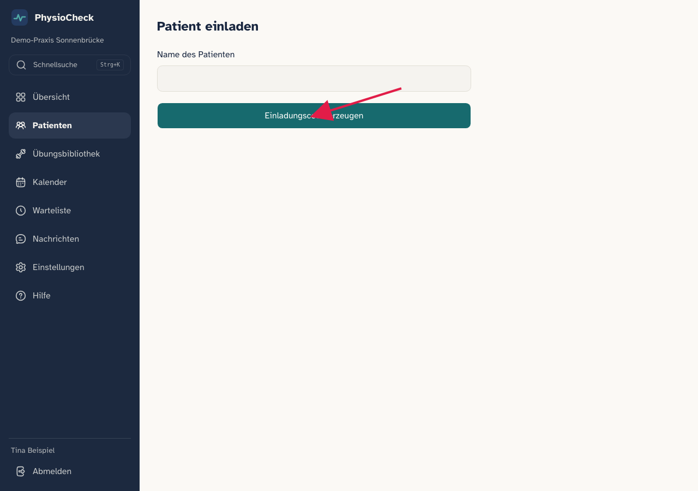

Unter **Patienten → Patient einladen** geben Sie den Namen ein und erzeugen einen Einladungscode. Der Code wird **nur direkt danach angezeigt** – notieren Sie ihn oder geben Sie ihn sofort an die Person weiter (persönlich, Telefon, Brief). Es wird keine E-Mail automatisch verschickt. Die Person gibt den Code beim ersten Anmelden in der App ein und ist danach mit Ihrer Praxis verbunden.

### Patientenliste

Unter **Patienten** sehen Sie alle verbundenen Patient:innen und offenen Einladungen. Ein Klick auf einen Namen öffnet die vollständige Patientenakte.

### Verordnungen und verordnete Sitzungen

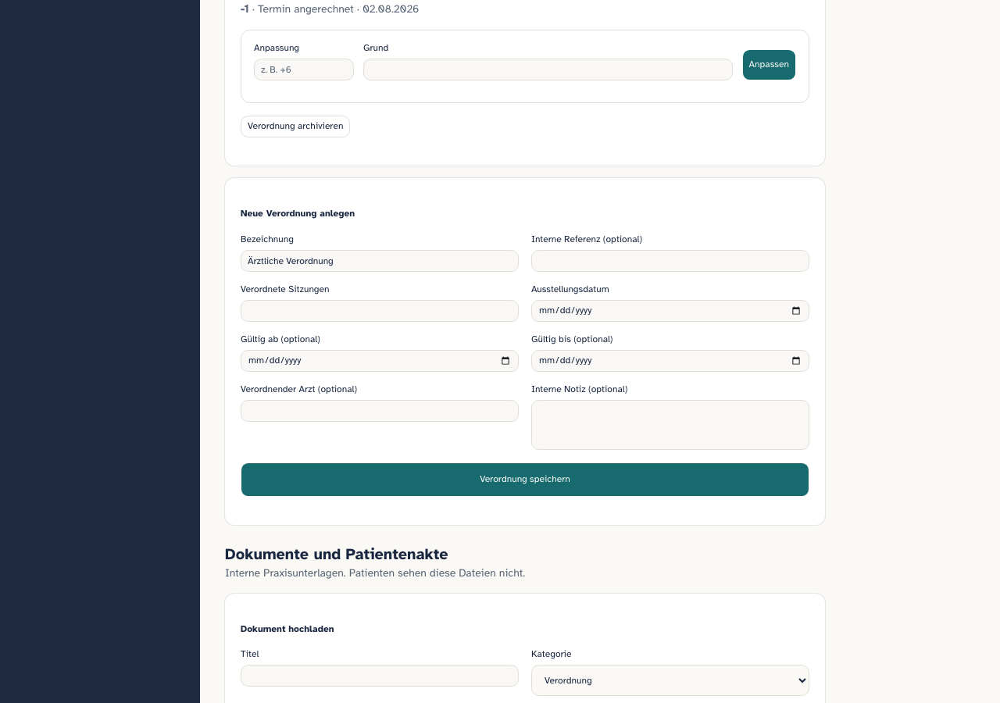

In der Patientenakte legen Sie eine **Verordnung** an: Bezeichnung, Anzahl verordneter Sitzungen, Ausstellungsdatum und optional Gültigkeitszeitraum und verordnender Arzt. Jeder abgeschlossene Termin rechnet automatisch genau eine Sitzung an – Sie müssen nichts manuell mitzählen. Über **„Anpassen"** mit Grund lässt sich die Anzahl bei Bedarf nachträglich korrigieren (z. B. bei einer Folgeverordnung); jede Änderung bleibt in der Historie sichtbar.

### Patient:in markieren

Die **Markierung** ist eine rein interne Notiz (z. B. „Rückruf wegen Terminplanung"), die nur Ihre Praxis sieht – Patient:innen bekommen davon nichts angezeigt. Nützlich, um sich kurzfristig etwas zu einer Person zu merken, ohne das in die eigentliche Akte zu schreiben. Bitte keine Gesundheitsdaten in dieses Feld eintragen.

### Kalenderfarbe

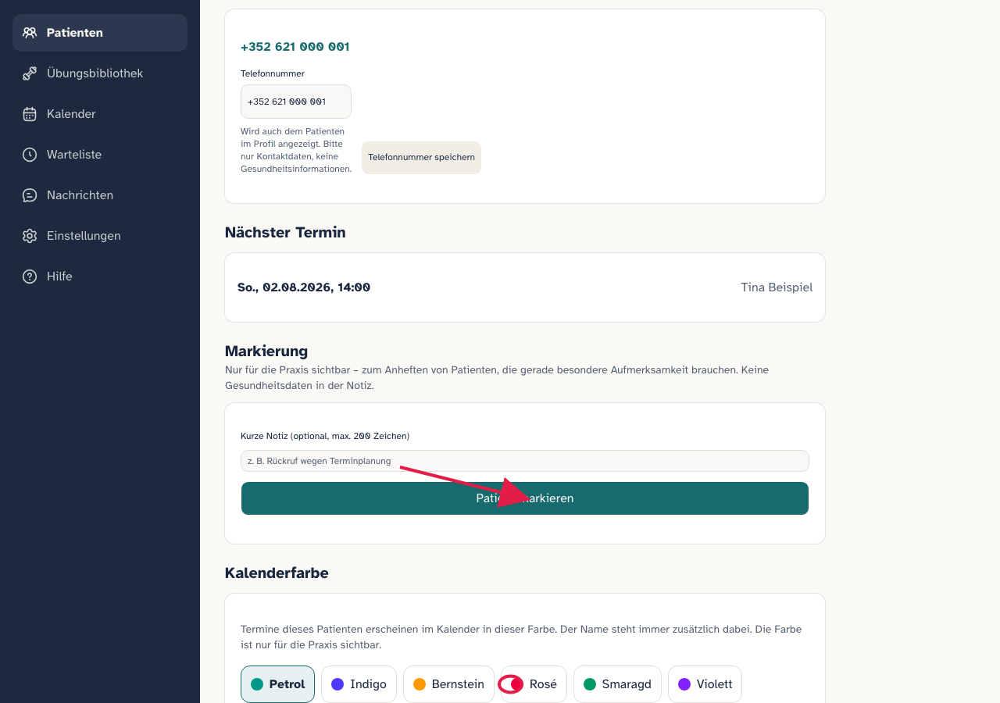

Jede:r Patient:in kann eine eigene Farbe bekommen, in der ihre/seine Termine im Praxiskalender erscheinen (der Name steht immer zusätzlich dabei). Das hilft bei vollen Kalendertagen, Termine auf einen Blick zuzuordnen. Die Farbe ist nur für die Praxis sichtbar.

### Internes Kurzprofil

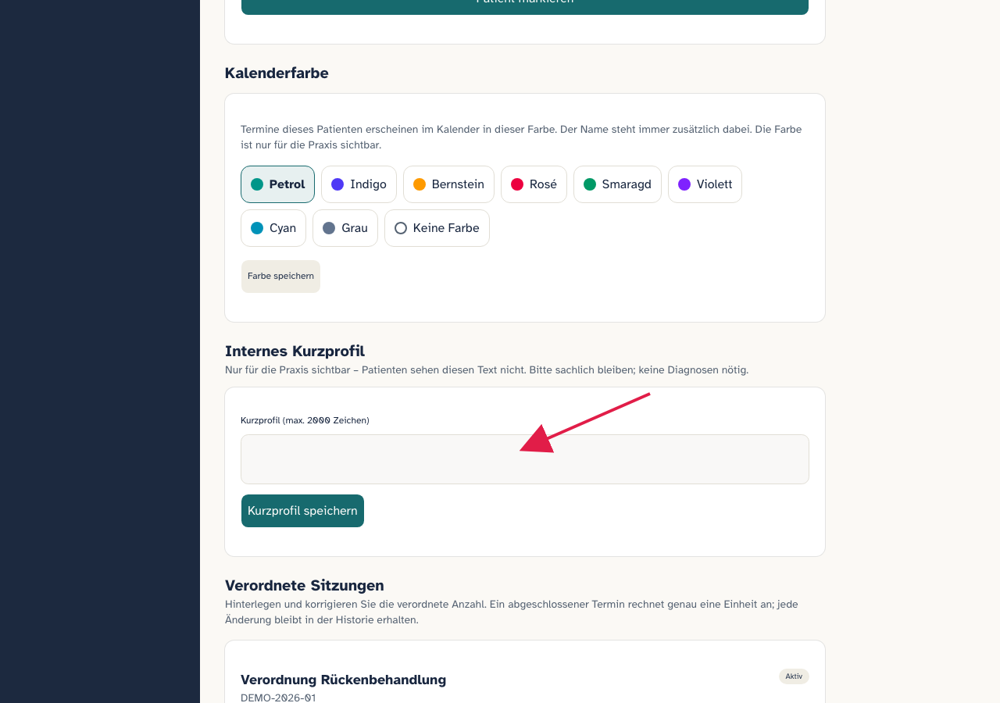

Das **Kurzprofil** ist ein freier Text (max. 2000 Zeichen), ebenfalls nur für die Praxis sichtbar – z. B. für organisatorische Hinweise. Bitte sachlich bleiben; Diagnosen gehören nicht hierher, sondern in die reguläre medizinische Dokumentation außerhalb der App.

### Dokumente hochladen

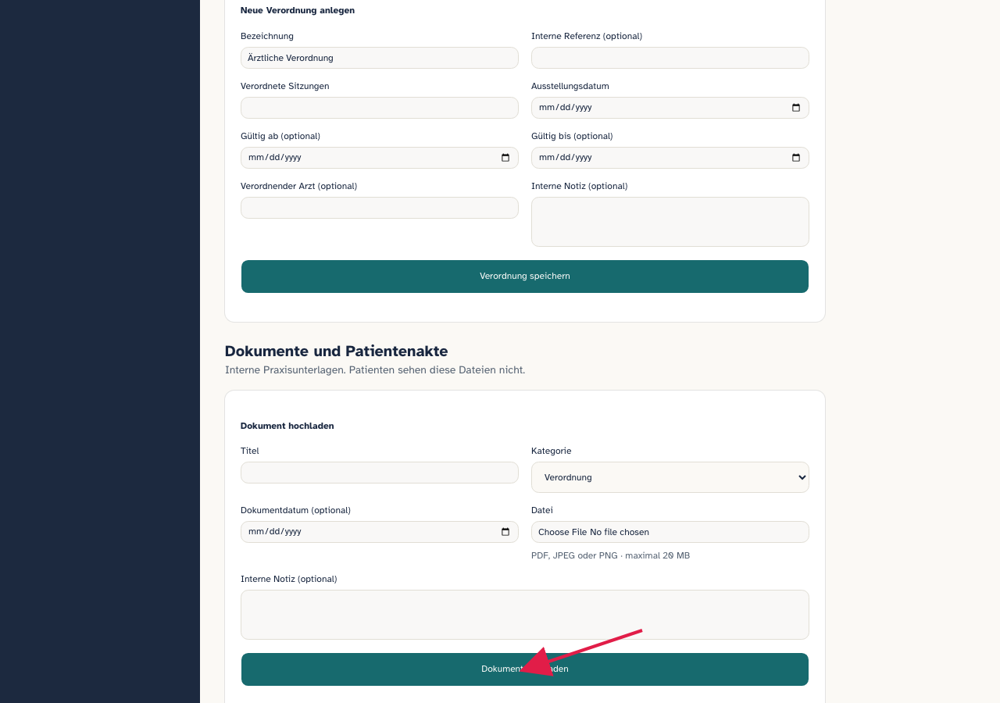

Hier laden Sie PDFs, JPEGs oder PNGs zur Patientenakte hoch (z. B. eine gescannte Verordnung), max. 20 MB. Diese Dokumente sind **interne Praxisunterlagen** – Patient:innen sehen sie nicht. Der Zugriff erfolgt für Praxismitglieder über kurzlebige, sichere Links statt über einen dauerhaft offenen Speicherort.

### Übungsplan erstellen und anpassen

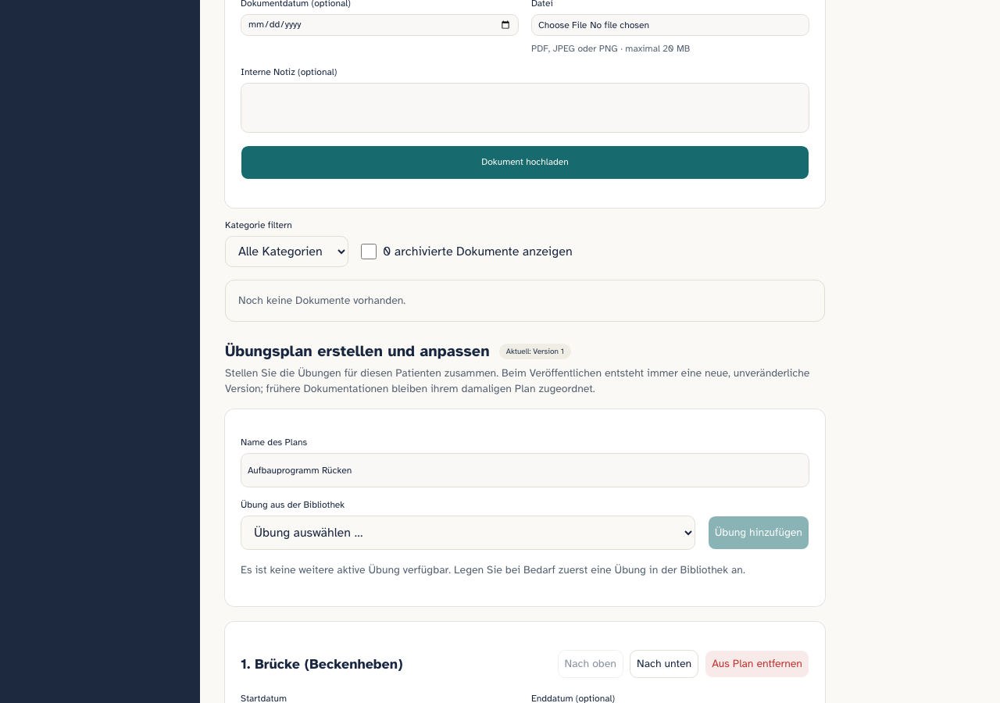

Weiter unten in der Patientenakte stellen Sie den **Heimübungsplan** zusammen: Plan benennen, Übungen aus der Bibliothek hinzufügen, mit „Nach oben"/„Nach unten" die Reihenfolge festlegen oder eine Übung wieder entfernen. Beim Veröffentlichen entsteht immer eine **neue, unveränderliche Version** – frühere Selbstauskünfte der Patientin/des Patienten bleiben dem damals gültigen Plan zugeordnet und werden nie rückwirkend verfälscht.

## Termine und Kalender

### Kalender-Übersicht

Unter **Kalender** wechseln Sie zwischen Monats-, Wochen-, Tages- und Listenansicht. Termine erscheinen in der jeweils hinterlegten Patientenfarbe.

### Termin anlegen

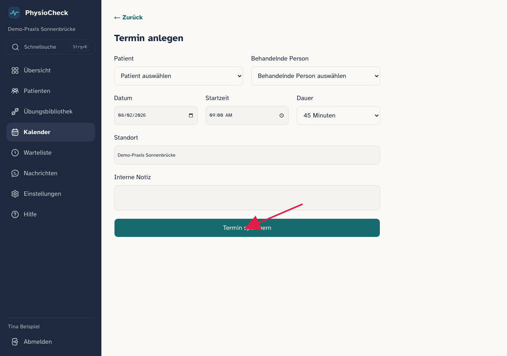

Patient:in, behandelnde Person, Datum, Startzeit und Dauer auswählen, optional eine interne Notiz ergänzen – fertig. Der Standort ist mit der Praxisadresse vorausgefüllt.

### Termin abschließen oder stornieren

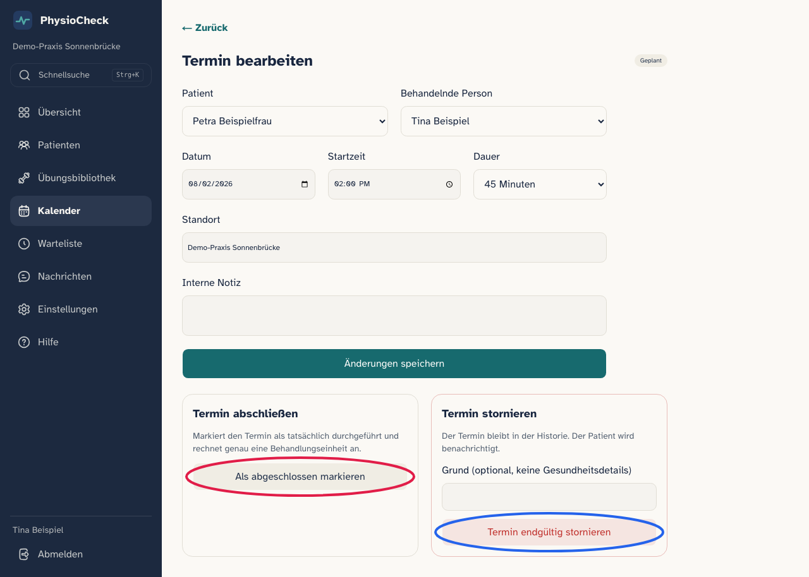

In einem bestehenden Termin haben Sie zwei zentrale Aktionen, deutlich farblich getrennt:

- **„Als abgeschlossen markieren"** (rot markiert im Bild): Der Termin gilt als tatsächlich durchgeführt und rechnet genau eine Behandlungseinheit von der Verordnung ab.
- **„Termin endgültig stornieren"** (blau markiert im Bild): Der Termin bleibt in der Historie sichtbar, wird aber storniert. Der Grund ist optional und darf **keine Gesundheitsdetails** enthalten – die Patientin/der Patient wird über die Stornierung benachrichtigt.

## Warteliste

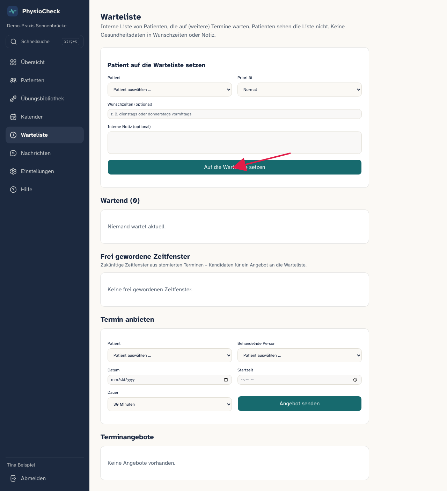

Unter **Warteliste** tragen Sie Patient:innen ein, die auf einen (weiteren) Termin warten, mit optionaler Priorität und Wunschzeiten. Wird ein Termin storniert, taucht das frei gewordene Zeitfenster automatisch im Abschnitt „Frei gewordene Zeitfenster" auf – von dort aus können Sie direkt ein Angebot an eine wartende Person senden. Auch hier gilt: keine Gesundheitsdaten in Wunschzeiten oder Notiz, Patient:innen sehen die Liste selbst nicht.

## Übungsbibliothek

### Übersicht

Unter **Übungsbibliothek** verwalten Sie alle Übungen, die Sie in Heimübungspläne aufnehmen können.

### Übung anlegen

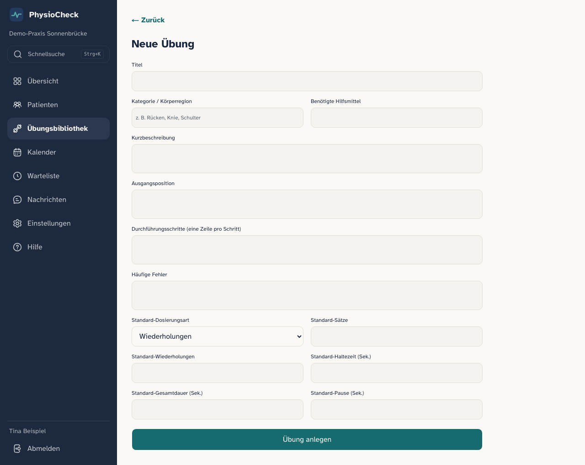

Titel, Kategorie/Körperregion, benötigte Hilfsmittel, Kurzbeschreibung, Ausgangsposition, Durchführungsschritte, häufige Fehler sowie Standardwerte für Wiederholungen, Sätze, Haltezeit und Pause. Diese Standardwerte lassen sich später pro Patient:in im Übungsplan individuell anpassen.

### Video und Bilder hochladen

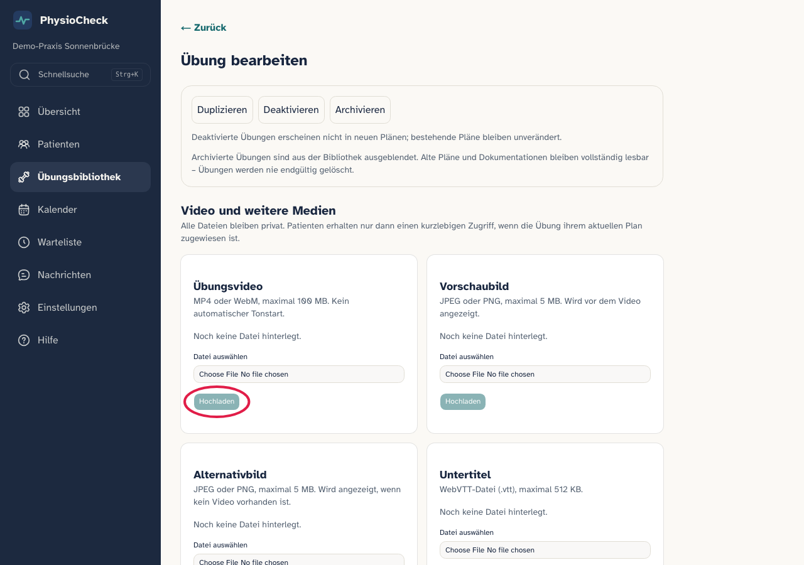

Zu jeder Übung können Sie ein **Übungsvideo** (MP4/WebM, max. 100 MB, kein automatischer Tonstart), ein Vorschaubild, ein Alternativbild (falls kein Video vorhanden ist) sowie eine Untertiteldatei hochladen. Alle Dateien bleiben privat – Patient:innen erhalten nur dann Zugriff, über einen kurzlebigen sicheren Link, wenn die Übung ihrem aktuellen Plan zugewiesen ist.

### Übung duplizieren, deaktivieren oder archivieren

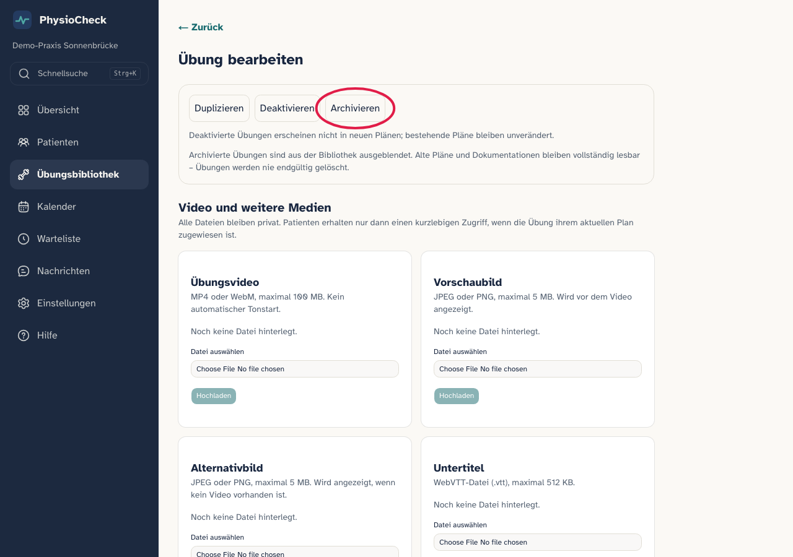

- **Duplizieren**: legt eine Kopie an, praktisch als Ausgangspunkt für eine ähnliche Übung.
- **Deaktivieren**: Die Übung erscheint nicht mehr in *neuen* Plänen, bestehende Pläne mit dieser Übung bleiben unverändert.
- **Archivieren**: Die Übung wird aus der Bibliothek ausgeblendet. Alte Pläne und Selbstauskünfte dazu bleiben vollständig lesbar – **Übungen werden nie endgültig gelöscht**.

### Vorschau: So sieht die Patientin/der Patient die Übung

Beim Bearbeiten einer Übung sehen Sie direkt daneben eine Vorschau, wie die Übung später in der Patienten-App dargestellt wird – so erkennen Sie sofort, ob Video, Bild und Text zusammenpassen.

## Nachrichten

Unter **Nachrichten** sehen Sie alle Unterhaltungen mit Ihren Patient:innen an einem Ort.

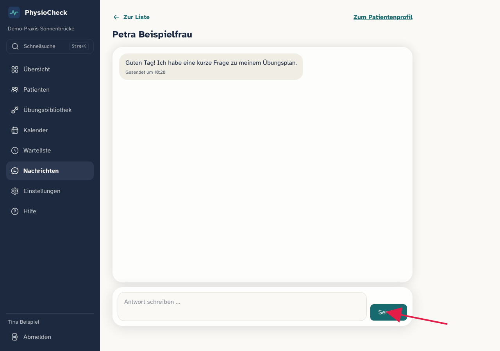

In einer einzelnen Unterhaltung sehen Sie den Verlauf und antworten über das Textfeld unten. Bitte auch hier auf Datensparsamkeit achten: keine ausführlichen Gesundheitsdetails in Nachrichtentexten, die als Push-Vorschau auf einem gesperrten Bildschirm auftauchen könnten.

## Praxiseinstellungen

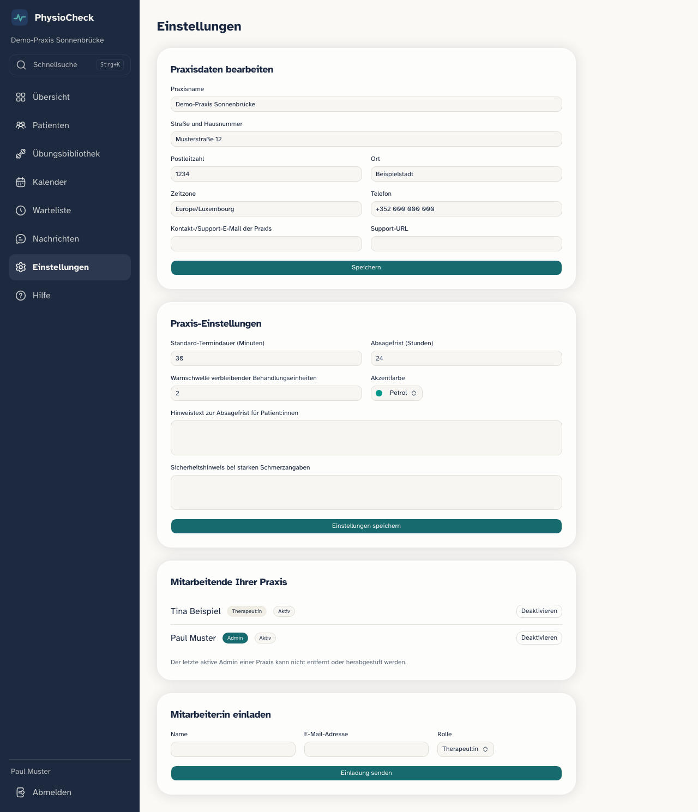

Unter **Einstellungen** (vollständig einsehbar für Admins; Therapeut:innen sehen die meisten Felder nur lesend) verwalten Sie:

- **Praxisdaten**: Name, Adresse, Zeitzone, Telefon, Kontakt-E-Mail.
- **Praxis-Einstellungen**: Standard-Termindauer, Absagefrist in Stunden, Warnschwelle für wenige verbleibende Behandlungseinheiten, Akzentfarbe der Praxis sowie die Hinweistexte, die Patient:innen zu Absagefrist und bei starken Schmerzangaben angezeigt bekommen.
- **Mitarbeitende Ihrer Praxis**: Liste aller Mitarbeitenden mit Rolle und Status, inklusive Deaktivieren einzelner Personen. Der letzte aktive Admin einer Praxis kann nicht entfernt oder herabgestuft werden, damit die Praxis nie ohne Admin dasteht.

### Mitarbeiter:in einladen

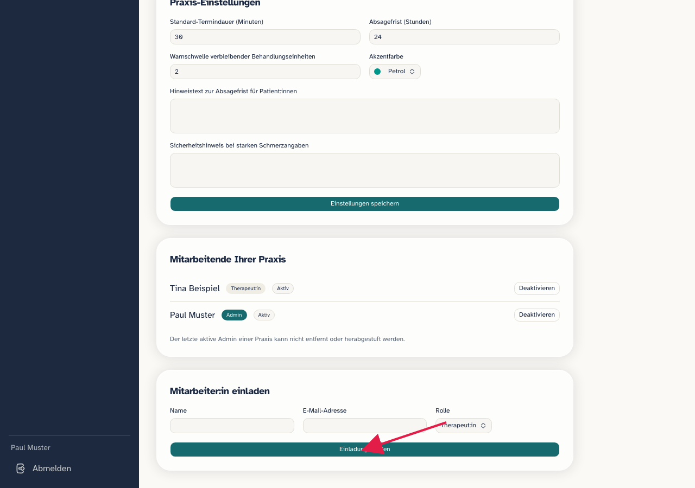

Nur als Admin sichtbar: Name, E-Mail-Adresse und Rolle (**Admin** oder **Therapeut:in**) eingeben und einladen. Der Einladungslink wird danach angezeigt und muss **selbst weitergegeben** werden (kein automatischer Mailversand) – gleiches Prinzip wie bei der Patienteneinladung.

## Hilfecenter

Unter **Hilfe** finden Sie ein durchsuchbares Hilfecenter direkt in der App, falls beim Arbeiten eine Frage auftaucht, ohne dass Sie dieses Dokument öffnen müssen.

## Verwandte Dokumente

- `docs/MANUAL_TESTING_GUIDE.md` – kompakte Klick-Anleitungen zum Selbst-Ausprobieren
- `docs/PLATFORM_ADMIN_GUIDE.md` – Betreiberportal: neue Praxis anlegen, Zugang zurücksetzen
- `docs/FEATURE_STATUS.md` – jede Funktion mit Prüfstatus
- `README.md` – Einstieg, Installation, Demo-Zugänge
